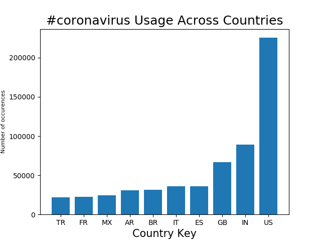
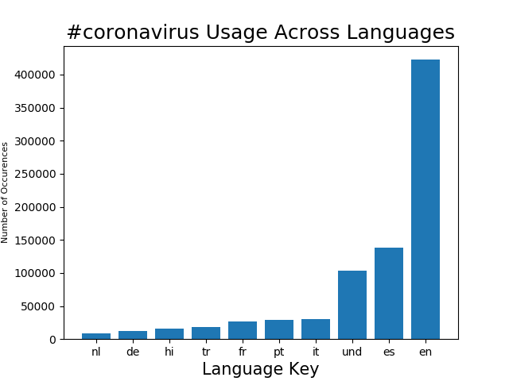
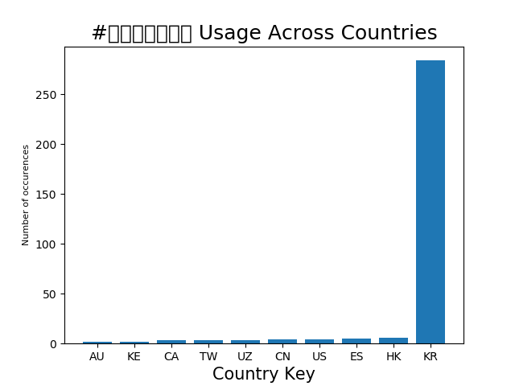

# Coronavirus twitter analysis

During this assignment I analyzed hashtag usage associated with the Covid-19 pandemic using all geotagged tweets made in 2020, a set of about 1.1 Billion.

From this I have been able to hone my skills: 

1. working with large scale datasets
1. working with multilingual text
1. using the MapReduce divide-and-conquer paradigm to create parallel code

## Background

**About the Data for this project:**

Approximately 500 million tweets are sent everyday.
Of those tweets, about 2% are *geotagged*.
That is, the user's device includes location information about where the tweets were sent from.
The lambda server's `/data/Twitter dataset` folder contains all geotagged tweets that were sent in 2020.
In total, there are about 1.1 billion tweets in this dataset.

## Process

**Map Reduce**
I used the [MapReduce](https://en.wikipedia.org/wiki/MapReduce) procedure to analyze these tweets.
This is a famous procedure that allows for large scale parallel processing and is widely used in industry.
It is a 3 step procedure summarized by the following image:


Using this process I first divided the data up indivually for each day using the code in the mapreduce file in the src file above. From this I created files that track country and also language data from these tweets JSON data for each file and brought this data back together using the following commands:

```
$ ./src/reduce.py --input_paths outputs_1/geoTwitter*.lang --output_path=reduced.lang_1
```

```
$ ./src/reduce.py --input_paths outputs_1/geoTwitter*.country --output_path=reduced.country_1
```

**Visualize Data**
My goal was to neatly graph the usage of different covid-related hashtags so I coded the visualize.py file that takes a hashtag as an input and either the language or country files to show the spread of usage. 
Here are four graphs my made exhibiting trends extrapolated from my data:








